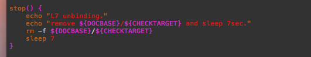

class: center, middle
# My Awesome Presentation

???

Notes for the _first_ slide!

---

# Agenda

1. Introduction
2. Deep-dive
3. ...

[NOTE]: Note that you need remark.js alongside this html file, but no internet connection.


???
hogehogehoge
fugfugafuga


---

# Introduction

## H2

this is a 'h2' content

### H3

this is a 'h3' content

#### H4

this is a 'h4' content

##### H5

this is a 'h5' content

???

hogehogehoeghoehgo

---

# Texts

```bash
> This is a Blockquotes # blockquotes

`hogehoge`              # inline code

**strong**              # strong

*italic*                # em

~strikethrough~         # strikethrough
```

> This is a Blockquotes 

`hogehoge`

**strong**

*italic*

~strikethrough~

---

# Code syntax highlight

```java
	public static void main(String[] args) {
		// do something
	}
```

---

# Language supports

- Hello!
- こんにちは!
- 안녕하세요!

---

# Images



---

# table

| Left align | Right align | Center align |
|:-----------|------------:|:------------:|
| This       | This        | This         |
| column     | column      | column       |
| will       | will        | will         |
| be         | be          | be           |
| left       | right       | center       |
| aligned    | aligned     | aligned      |

